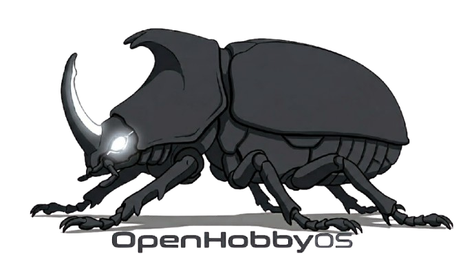
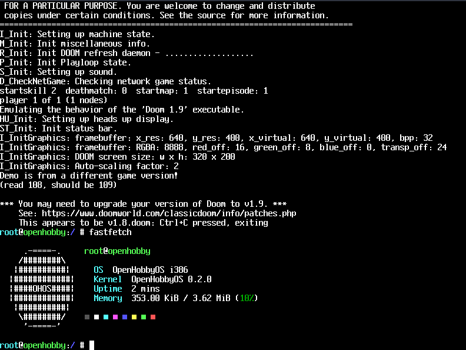

## OpenHobbyOS (OHOS) — 32-bit x86 Hobby OS

OpenHobbyOS is a 32-bit x86 hobby operating system with a POSIX-like environment, preemptive multitasking, Linux ABI syscall compatibility, and support for running Doom, Qt6, and other ported software.

---

## What's Under the Hood?

* Kernel: Monolithic, preemptive multitasking, round-robin scheduler.
* Memory: Paging with per-process page directories, copy-on-write fork.
* Syscall ABI: Linux ABI via int 0x80 (80+ syscalls).
* VFS: initrd, devfs, read/write ext2.
* Disk Encryption: AES-256-XTS at boot via mbedTLS. Passphrase prompt before root mount, PBKDF2-HMAC-SHA256 key derivation, per-sector encrypt/decrypt.
* Graphics: XNX compositor (windowing, z-ordering) backed by pixman. libtsm VT100 terminal emulator.
* Networking: TCP/IP via lwIP, RTL8139 PCI NIC driver.
* Power: Shutdown, reboot, suspend via uACPI.

---

## What Can It Run?

Ports available via the i686-openhobbyos-elf toolchain:

* Multimedia: FFmpeg, ohplay (audio player)
* Gaming: Doom, TinyGL
* Tools: Fastfetch, zlib, Qt6 (custom QPA plugin)

---

## Getting Started

Requires an x86 system or VM.

### Requirements
* Architecture: IA-32 / i386 (or x86-64 in 32-bit mode)
* Memory: 200-500 MB
* Build: gcc-multilib (or i686-elf-gcc), nasm 2.15+, make, python3, xorriso, grub-mkrescue

### Build

    # Build the kernel, ports, and generate a bootable ISO
    make all

    # Launch the OS in QEMU
    make run

    # Run with serial output if you're debugging
    make run-debug

You can find the final bootable ISO at build/ohos.iso.

---

## History

Originally the ElexerKernel project (2013). First public repository published 2025.

---

## Acknowledgments

uACPI, lwIP, libtsm, pixman, Qt6, FFmpeg, TinyGL, mbedTLS.

Artwork by Mark Sordestom.

---

## License
OHOS is open-source under the BSD 3-Clause License. See the LICENSE file for more details.
